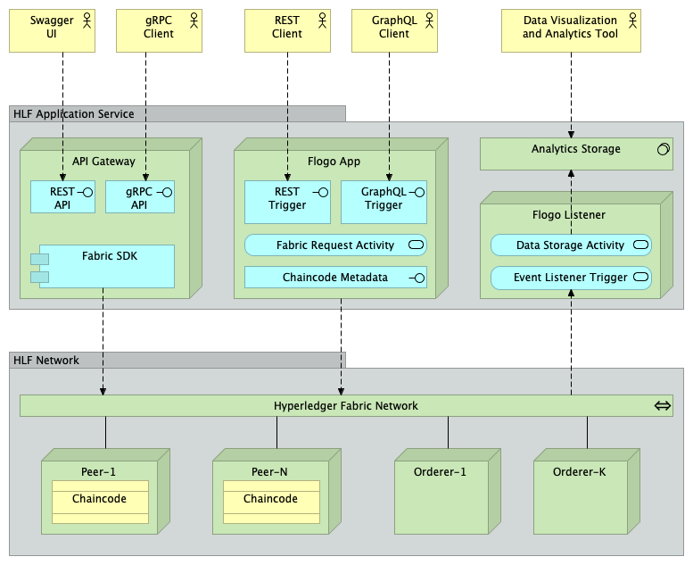
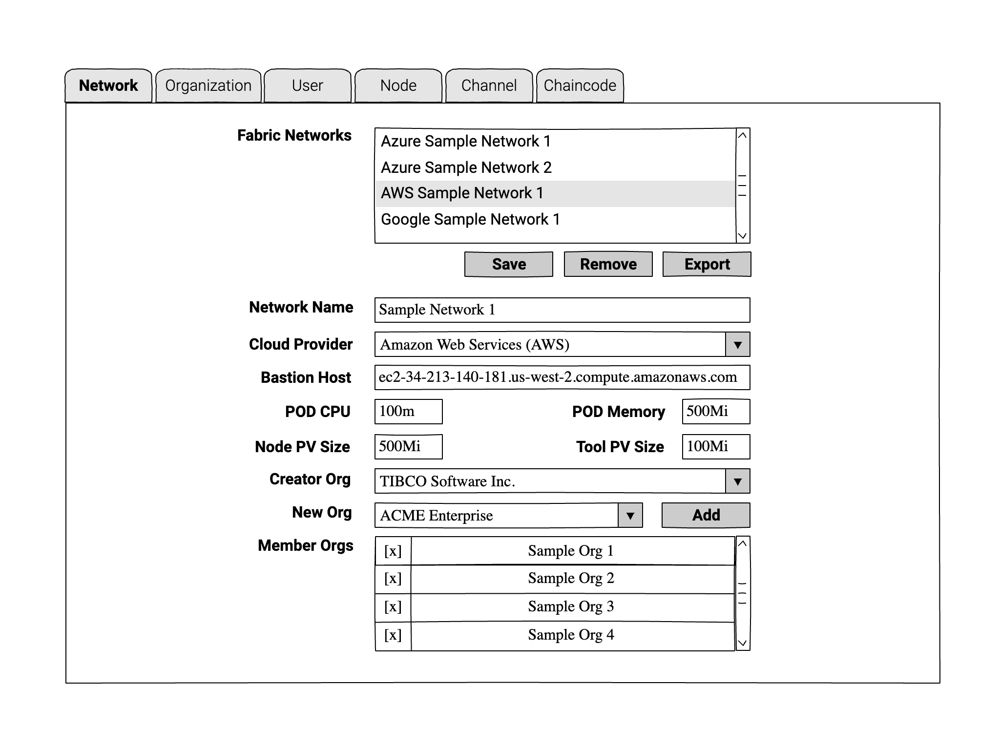
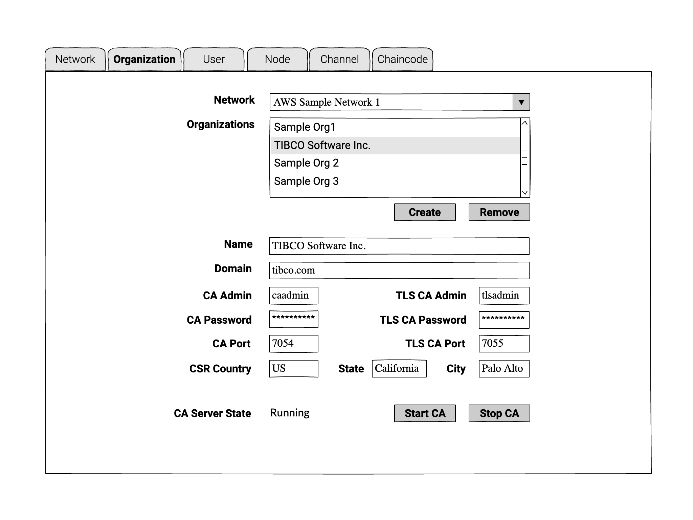
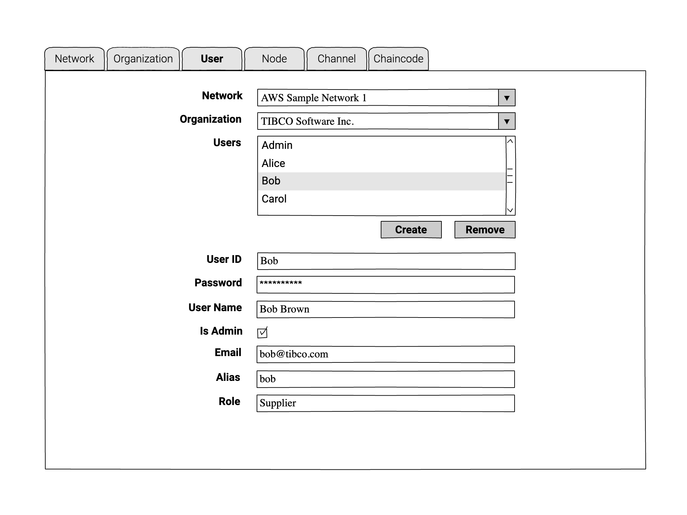
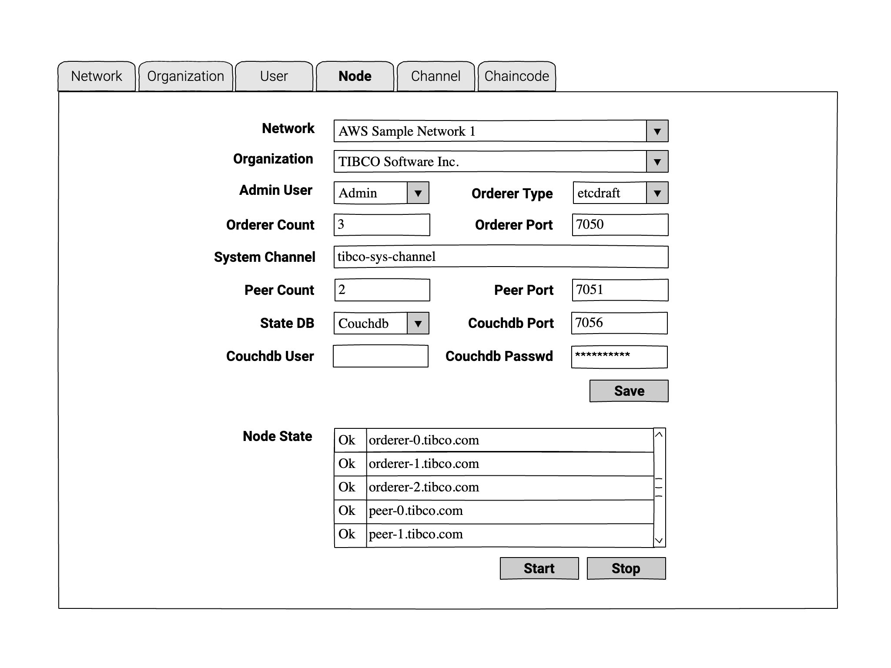
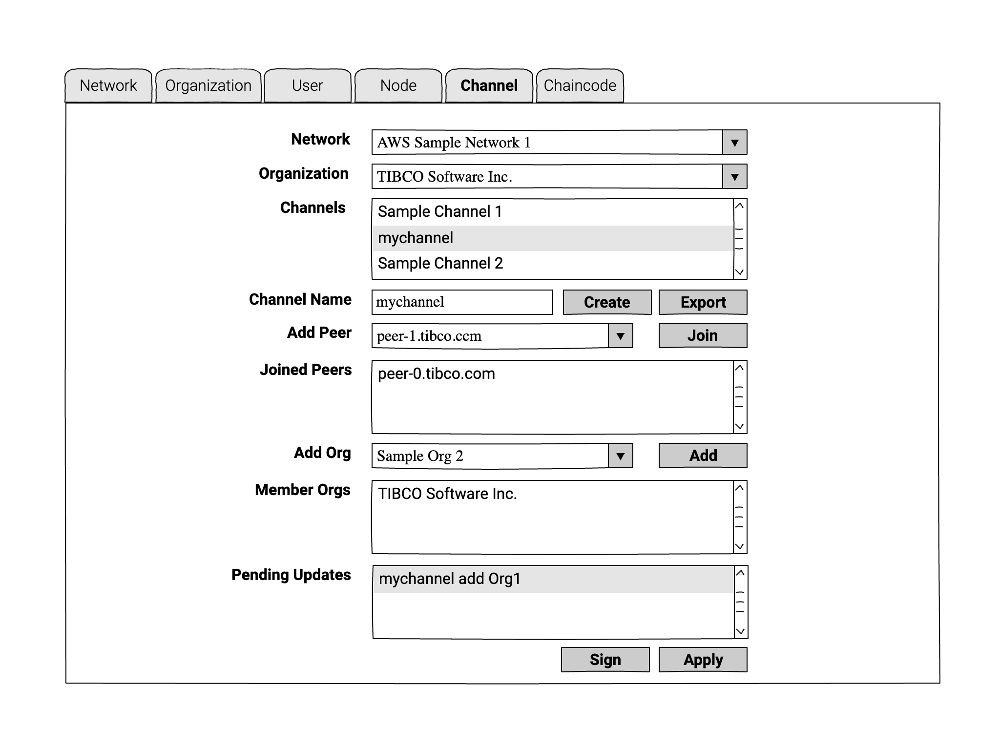
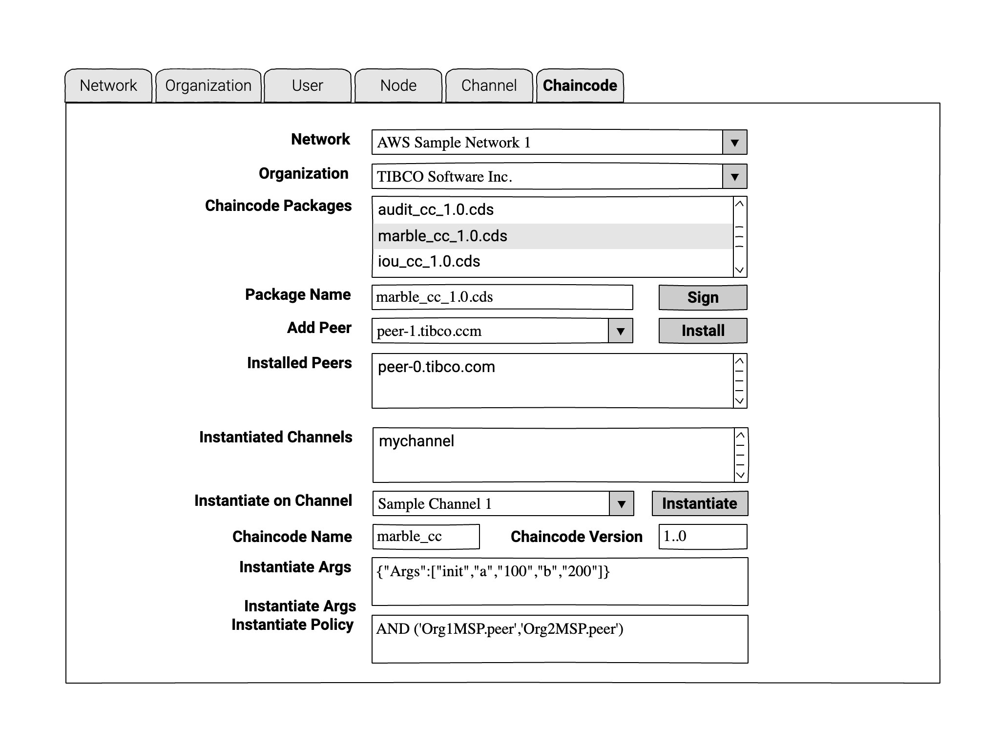

# Operation UI

This is a possible user-interface for managing Hyperledger Fabric networks deployed in multiple clouds.

## Logical Architecture of Dovetail Apps for Hyperledger Fabric

## Wireframes for Network Admin UI

### Network Configuration

A Hyperledger Fabric network created in a specified cloud service provider and configured via a REST service running on a bastion host.

- **Save**: Creates or updates a network configuration on the Web server.
- **Remove**: Deletes a selected network configuration on the Web server.
- **Export**: Download all defined network configuration from the Web server.
- **Add**: Add a new organization to the nework (the new org must be defined via the "Organization" tab first.

### Organization Configuration

Create or delete the definition of an organization in a specified Hyperledger Fabric network.

- **Create**: Define a new organization, and specify attributes of CA and TLS CA servers for managing crypto data of peers, orderers, and users.
- **Start CA**: Send request to bastion host to start the CA and TLS CA servers for the specified organization.
- **Stop CA**: Send request to bastion host to shudown CA and TLS CA servers for the specified organization.

### User Configuration

Create or delete Hyperledger Fabric admin or client users.

- **Create**: add a user for a specified fabric network and organization; send request to bastion host to create crypto data for the user.
- **Remove**: delete the user of a specified fabric network and organization; send request to bastion host to clean up the crypto data for the user.

### Node Configuration

Configure and create orderers and peers for a specified fabric network and organization.

- **Save**: Create or scale number of orderer and peers. Send request to the bastion host to create crypto data for the orderer and peer nodes. For existing network, only the counts of orderer and peer can be increased, in which case, crypto data will be created for the new nodes, and new nodes will be added to the network's system channel.
- **Start**: Send request to bastion host to start all nodes, or additional new nodes if the network is already running.
- **Stop**: Send request to bastion host to stop all nodes.

### Channel Configuration

Act as admin of specified organization to create channel for a specified fabric network, and perform channel operations.

- **Create**: Send request to bastion host to create a new channel.
- **Join**: Send request to bastion host to make a specified peer node join a selected channel.
- **Add**: Send request to bastion host to create channel update transaction for adding a new member org to a specified channel. Update the channel if the acting org is the only member of the channel, otherwise, wait for approval by other member orgs.
- **Sign**: Send request to bastion host to sign a pending channel-update transaction.
- **Apply**: Send request to bastion host to execute the selected transaction for channel-update. The update will succeed only if enough number of member orgs have signed the transaction.
- **Export**: Send request to bastion host to download network config file for fabric client connections.

### Chaincode Operations

Assuming that chaincode is packaged and uploaded to bastion host via other processes, this UI will manage the installation and instantiation process.

- **Sign**: Send request to bastion host to sign a specified chaincode package. This is necessary only if the chaincode has a policy that requires approval by multiple member orgs.
- **Install**: Send request to bastion host to install the selected chaincode on a specified peer node.
- **Instantiate**: Send request to bastion host to instantiate or upgrade the selected chaincode on a specified channel.

