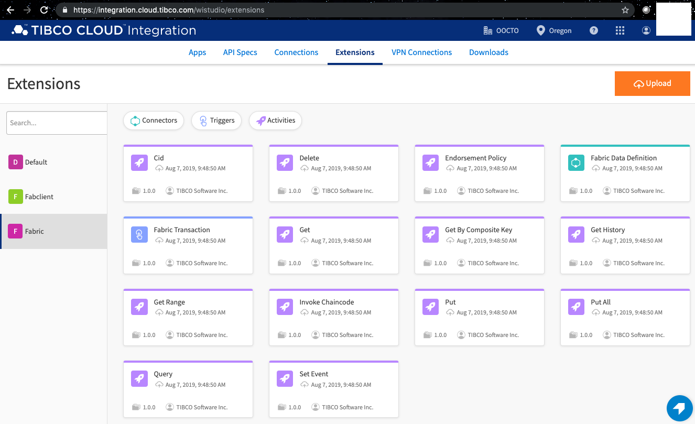
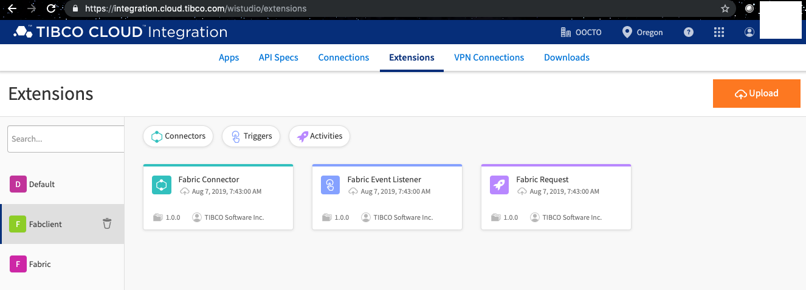
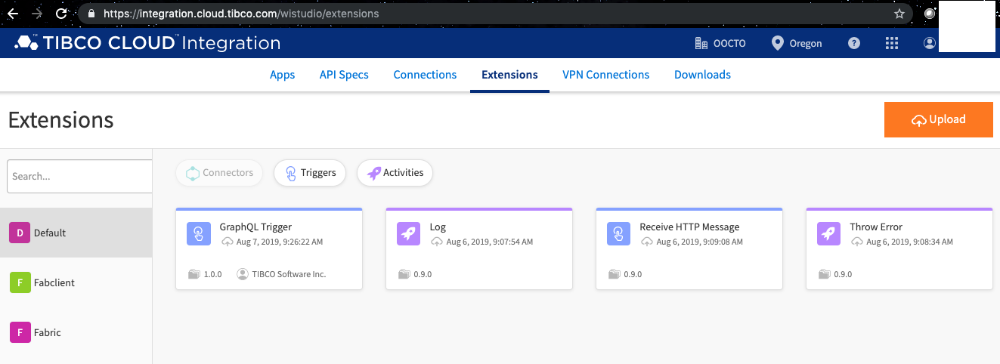

# Modeling with TIBCO Cloud Integration (TCI)

If you are a subscribe of [TIBCO Cloud Integration](https://cloud.tibco.com/), you can sign in, and start developing Flogo models for Hyperledger Fabric apps as follows:

## Upload Flogo Extensions

The following video illustrates how to upload Flogo extensions to your TCI account:

<video width="480" height="320" controls="controls">
    <source src="upload-extension.mp4" type="video/mp4">
</video>

The samples in this project use the following extensions:
- [Fabric Chaincode Extension](../fabricExtension.zip), which is described in [README](../fabric/README.md)
- [Fabric Client Extension](../fabclientExtension.zip), which is described in [README](../fabclient/README.md)
- [GraphQL Trigger](./trigger-graphql.zip), which is an open-source project, [project-flogo/graphql](https://github.com/project-flogo/graphql)
- [REST Trigger](./trigger-rest.zip), which is from the open-source project, [project-flogo/contrib](https://github.com/project-flogo/contrib)
- [Log Activity](./activity-log.zip), which is from the open-source project, [project-flogo/contrib](https://github.com/project-flogo/contrib)
- [Error Activity](./activity-error.zip), which is from the open-source project, [project-flogo/contrib](https://github.com/project-flogo/contrib)

After these extensions are uploaded, the following activity and triggers should be available in the TCI development environment:

### Fabric Chaincode Extensions

### Fabric Client Extensions

### Open-source Flogo Extensions

## Import Apps
You can then select and import an application model from the sample folders.  For example, the following video shows the steps to import the sample app `equipment_gql.json` in [samples/equipment](../samples/equipment):

## Create Apps
You can create the same app, `equipment_gql` from scratch as shown in the following video:

